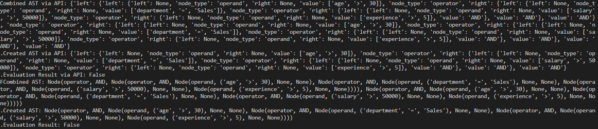
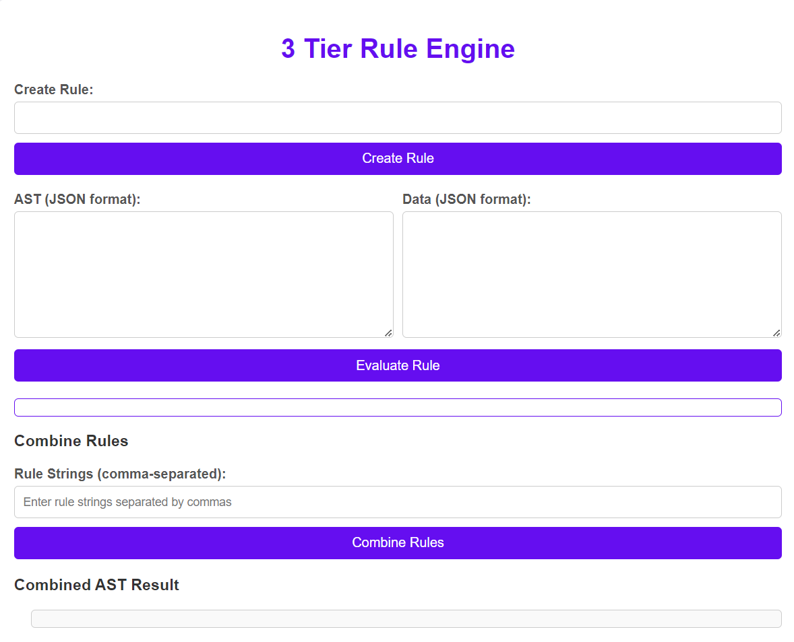
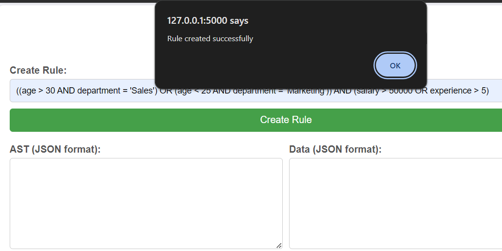
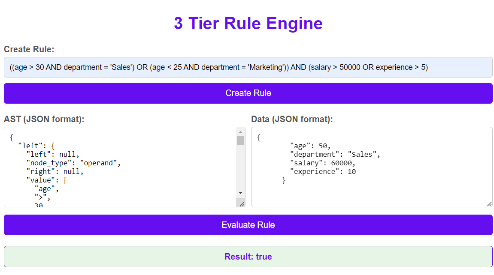

# 3 Tier Rule Engine Application

## Overview
A simple 3-tier rule engine application (with a simple UI, API, and backend data) to determine user eligibility based on attributes such as age, department, income, spending, etc. The system uses an Abstract Syntax Tree (AST) to represent conditional rules and allow for the dynamic creation, combination, and modification of these rules.

## Features
  - **Create Rule**: Allows users to create rules based on given attributes. Generates an AST from a rule string, validating its format and structure.
  - **Combine Rules**: Combines multiple ASTs into one using AND operators.
  - **Evaluate Rule**: Evaluates the AST against provided data, checking for valid data formats.
  - **Error Handling (Bonus)**: Handles invalid rule strings and data formats and provides meaningful error messages to the user through validate_attribute, validate_operator and validate_operand.

## Project Structure
- `app/`: Contains the main application code.
  - `__init__.py`: This file defines the Flask application factory. It initializes the Flask app and sets up the API routes by importing and initializing them.
  - `api.py`: Provides API functions to interact with the rule engine. This API provides the following routes: '/' , '/create_rule' (POST), '/combine_rules' (POST), '/evaluate_rule' (POST) and '/load_rules' (GET).
  - `ast.py`: Defines the AST data structure.
  - `database.py`: Handles database initialization and operations. Database has been developed ad stored in the database.db file.
  - `rules.py`: This module handles rule creation, combination, evaluation, and AST serialization/deserialization.
  - `static/`: Contains static files (CSS, JavaScript).
    - `css/`: 
      - `style.css`: CSS styles.
    - `js/`:
      - `script.js`: JavaScript files.
  - `templates/`:
      - `index.html`: Main UI template.
  
- `tests/`: Contains unit tests.
  - `test_rules.py`: Tests for rule creation, combination, and evaluation.
  - `test_api.py`: Tests for the API functions.
- `requirements.txt`: List of the required dependencies.
- `main.py`: The entry point of the application.
- `README.md`: This documentation file.
- `database.db`: The database that stores the rules and application metadata.

## Instructions

  ### Prerequisites
  - Python 3.6 or higher
  - Flask
  - SQLite3 (for database)
  - Werkzeug

  ### Build and Install
  ###  Create a virtual environment 
    python -m venv venv
  ### Initialize the virtual environment 
    venv/Scripts/activate
  ### Install dependencies:
      pip install -r requirements.txt
  ### Initialize the database:
      python -c "from app.database import initialize_database; initialize_database()"
  ### Run the application:
      python main.py
  Open your web browser and go to `http://127.0.0.1:5000/`.

## Predefined test cases:
### Run the tests or directly browse it on the web browser with the help of sample examples given below:
    python -m unittest discover tests

## Test
### Sample tests to try on UI
  ### Creating the rule
    ((age > 30 AND department = 'Sales') OR (age < 25 AND department = 'Marketing')) AND (salary > 50000 OR experience > 5)

  Input the above line in create rule text box and press the create rule button. It will prompt as the rule being created if successfull and generates the relevant AST (autofill).

  ### Input a query to evaluate:
      {
        "age": 50,
        "department": "Sales",
        "salary": 60000,
        "experience": 10
      }

  Input this json in "Data (JSON format):" and press evaluate button which will hence generate the reult as True or False.

## Snippets

### Sample run of Test Cases

### Basic UI

### Create Rule

### Evaluate Rule

